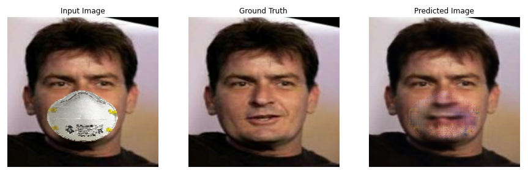
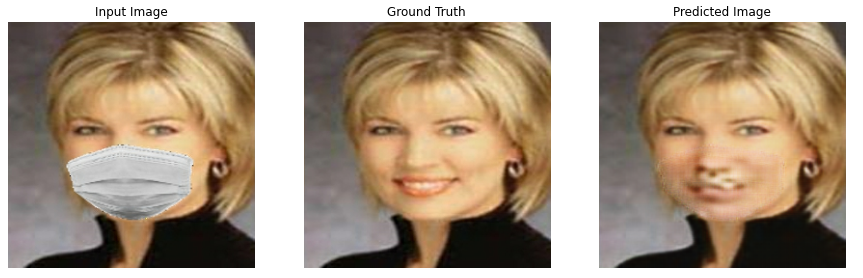
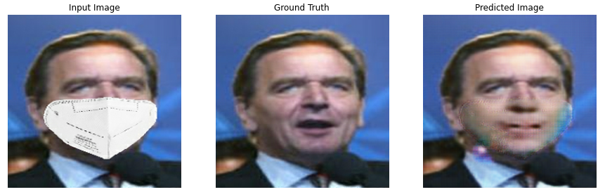

## Unmasking Face Mask GAN

### Overview
This project employs a Generative Adversarial Network (GAN) to remove face masks from images. The GAN comprises a generator and a discriminator. The generator aims to produce realistic images of individuals without face masks, while the discriminator learns to differentiate between real and generated images.

### Model Architecture
The generator is designed with multiple downsampling and upsampling layers, along with skip connections to retain image details. It takes a masked image as input and generates a corresponding unmasked image.

### How It Works

1. The generator takes a masked image as input and produces an unmasked image.
2. The discriminator receives pairs of masked and unmasked images and learns to classify them as real or generated.
3. The generator and discriminator are trained simultaneously, where the generator strives to create realistic unmasked images, while the discriminator aims to distinguish between real and generated images.
4. Through adversarial training, the generator enhances its ability to generate high-quality unmasked images that deceive the discriminator.

### Showing Predictions

To demonstrate the effectiveness of the model, here are some examples of images generated by the trained model:

